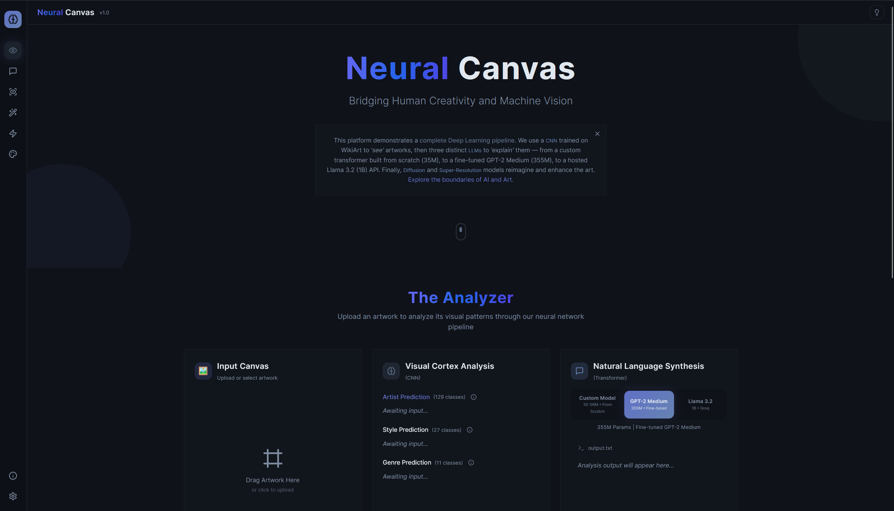
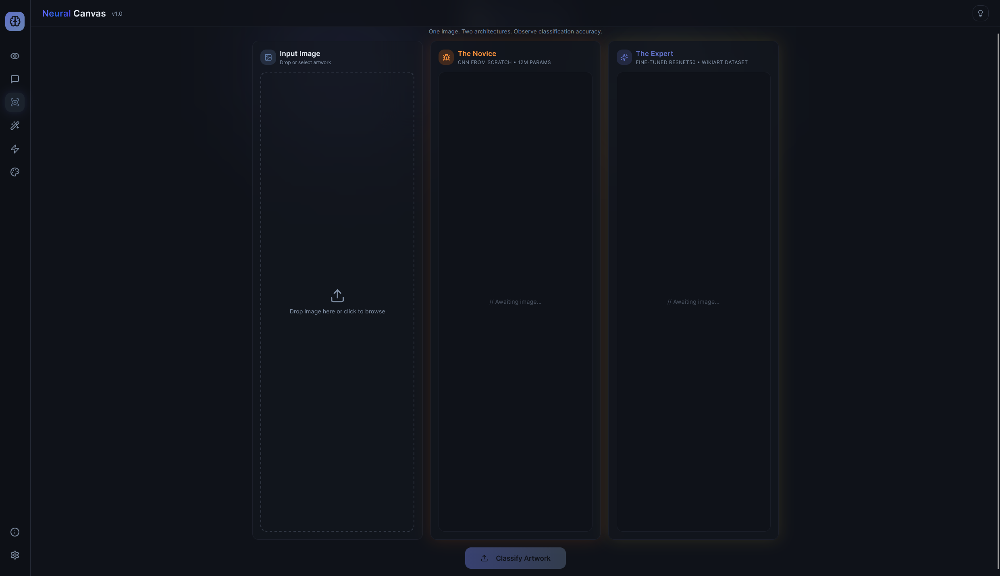
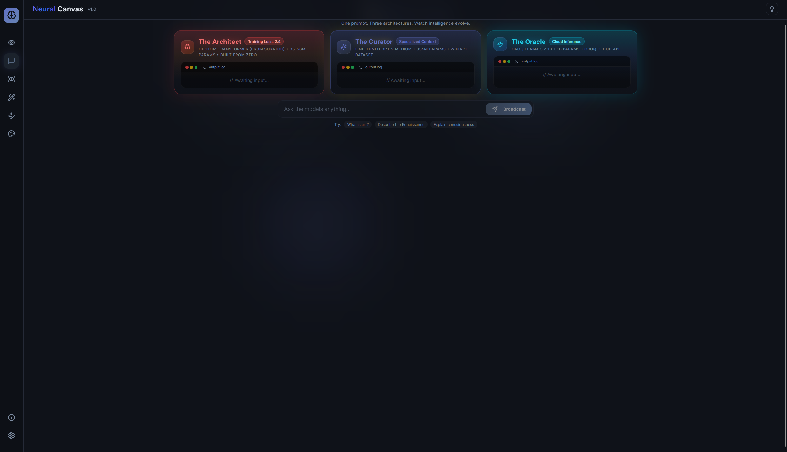
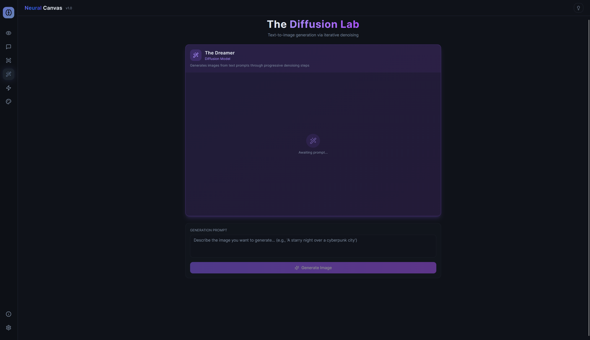
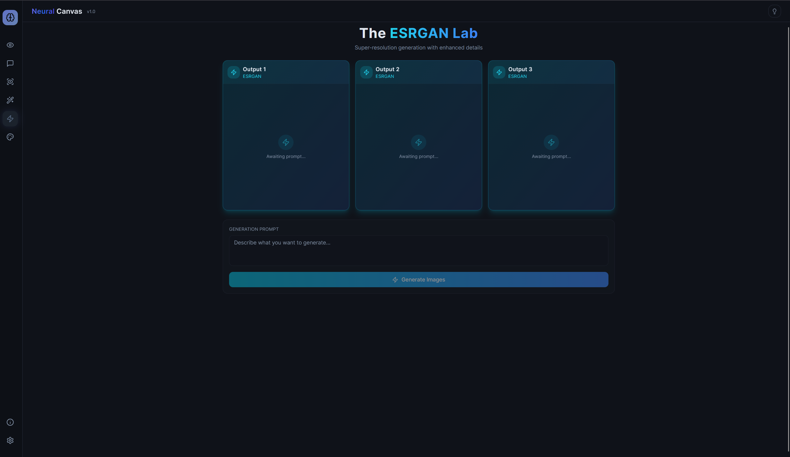
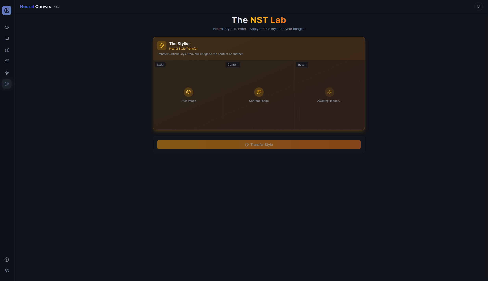

# Neural Canvas

An AI-powered art analysis platform combining Convolutional Neural Networks for artwork classification with Large Language Models for generating human-readable explanations.



## Overview

Neural Canvas is a full-stack application that demonstrates the integration of deep learning models for art analysis. The system classifies artwork by artist, style, and genre using CNNs, then uses LLMs to generate natural language explanations of the predictions.

## Features

### Art Analyzer
Upload any artwork and get instant predictions for:
- **Artist** attribution (129 artists from WikiArt)
- **Style** classification (27 art movements)
- **Genre** detection (10 categories)

Three LLM models provide different perspectives on the artwork:
- **The Architect** (56M params) - Custom transformer trained from scratch
- **The Curator** (355M params) - Fine-tuned GPT-2 Medium
- **The Oracle** (1B params) - Llama 3.1 via Groq API

### CNN Arena


Compare predictions between two CNN architectures:
- **Custom CNN** (64.21% macro accuracy) - Built from scratch with multi-head classification
- **Fine-tuned ConvNeXt-Tiny** (74% macro accuracy) - Transfer learning approach

### Text Generation


Interactive text completion using the trained LLM models. Test how well the models understand art concepts, techniques, and history.

### Generative Labs (Diffusion Branch)

The following features are available on the `diffusion` branch:

#### Diffusion Lab


Generate artwork using Stable Diffusion with customizable parameters.

#### ESRGAN Lab


Upscale and enhance images using Real-ESRGAN.

#### Neural Style Transfer


Apply artistic styles from famous paintings to your photos.

## Project Structure

```
neural-canvas/
├── cnn_models/           # CNN training and inference
│   ├── model.py          # Custom multi-head CNN architecture
│   ├── model_timm.py     # TIMM-based ConvNeXt model
│   ├── train.py          # Training script for custom CNN
│   ├── train_timm.py     # Training script for fine-tuned model
│   ├── dataset.py        # WikiArt data loading
│   └── config.py         # Hyperparameters
│
├── llm/                  # Language model components
│   ├── models/
│   │   └── art_expert_model.py    # Custom transformer architecture
│   ├── utils/
│   │   ├── curated_art_dataset.py     # Dataset curation (~210K samples)
│   │   ├── cnn_explainer_dataset.py   # CNN explanation pairs
│   │   └── clean_art_critic_dataset.py
│   └── scripts/
│       ├── train_cnn_explainer_from_scratch.py  # Model 1 training
│       ├── train_model2_cnn_explainer.py        # Model 2 fine-tuning
│       ├── evaluate_models.py                    # BLEU, ROUGE, perplexity
│       └── comprehensive_evaluation.py           # Full evaluation suite
│
├── frontend/             # React + Vite application
│   ├── backend/
│   │   └── app.py        # Flask API server
│   ├── components/       # React components
│   └── app/              # Next.js pages
│
├── checkpoints/          # Trained model weights
│   ├── cnn_explainer_from_scratch/
│   └── model2_cnn_explainer_gpt2medium/
│
└── requirements.txt
```

## CNN Models

### Custom CNN (From Scratch)
- Multi-head architecture for simultaneous artist/style/genre prediction
- 4 convolutional blocks with batch normalization
- Shared feature extractor with task-specific heads
- Trained on WikiArt dataset (~80K images)
- **Macro Accuracy: 64.21%**

### Fine-tuned ConvNeXt-Tiny
- Transfer learning using pretrained ImageNet weights
- ConvNeXt-Tiny backbone (28M parameters)
- Multi-head classification layer
- **Macro Accuracy: 74%**

## LLM Models

### Model 1: The Architect (From Scratch)
- Custom GPT-style transformer
- 8 layers, 512 hidden dimension, 8 attention heads
- ~56 million parameters
- Trained on curated art knowledge dataset
- Generates explanations for CNN predictions

### Model 2: The Curator (Fine-tuned)
- GPT-2 Medium base (355M parameters)
- Fine-tuned on art explanation dataset
- Better coherence and factual accuracy
- Slower but higher quality outputs

### Model 3: The Oracle (API)
- Llama 3.1 8B via Groq API
- Real-time inference
- Highest quality explanations
- Requires API key

## Training Data

### CNN Training
- **WikiArt Dataset**: ~80,000 artwork images
- 129 artists, 27 styles, 10 genres
- Stratified train/val/test split (80/10/10)

### LLM Training
- **WikiArt Metadata**: ~120,000 samples (artist/style/genre descriptions)
- **ELI5**: ~40,000 samples (simple explanations)
- **OpenAssistant**: ~50,000 samples (conversational quality)
- **Total**: ~210,000 curated training examples

## Installation

### Requirements
- Python 3.10+
- Node.js 18+
- CUDA-capable GPU (recommended)

### Backend Setup
```bash
# Create virtual environment
python -m venv .venv
.venv\Scripts\activate  # Windows
source .venv/bin/activate  # Linux/Mac

# Install dependencies
pip install -r requirements.txt
```

### Frontend Setup
```bash
cd frontend
npm install
```

### Running the Application

1. Start the backend:
```bash
cd frontend/backend
python app.py
```

2. Start the frontend:
```bash
cd frontend
npm run dev
```

3. Open http://localhost:3000

## Evaluation Results

### CNN Performance
| Model | Artist Acc | Style Acc | Genre Acc | Macro Acc |
|-------|-----------|-----------|-----------|-----------|
| Custom CNN | 58.3% | 67.1% | 71.2% | 64.21% |
| ConvNeXt-Tiny | 68.5% | 76.2% | 81.3% | 74.0% |

### LLM Metrics
| Metric | Model 1 (56M) | Model 2 (355M) |
|--------|---------------|----------------|
| Perplexity | 11.68 | 1.59 |
| BLEU-4 | 0.0000 | 0.0048 |
| ROUGE-L | 0.0000 | 0.0875 |
| Vocab Diversity | 0.222 | 0.408 |

## Branches

- **main**: CNN and LLM models, core functionality
- **diffusion**: Image generation features (Stable Diffusion, ESRGAN, NST)

## Tech Stack

- **Frontend**: React, Vite, TailwindCSS, shadcn/ui
- **Backend**: Flask, Flask-CORS
- **ML Frameworks**: PyTorch, Transformers, TIMM
- **APIs**: Groq (Llama 3.1)
- **Dataset**: HuggingFace Datasets (streaming)

## Acknowledgments

- WikiArt for the artwork dataset
- HuggingFace for model hosting and datasets
- Groq for API access to Llama models
